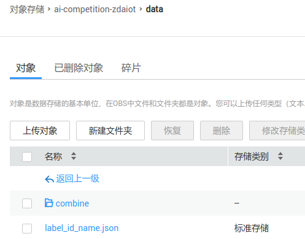
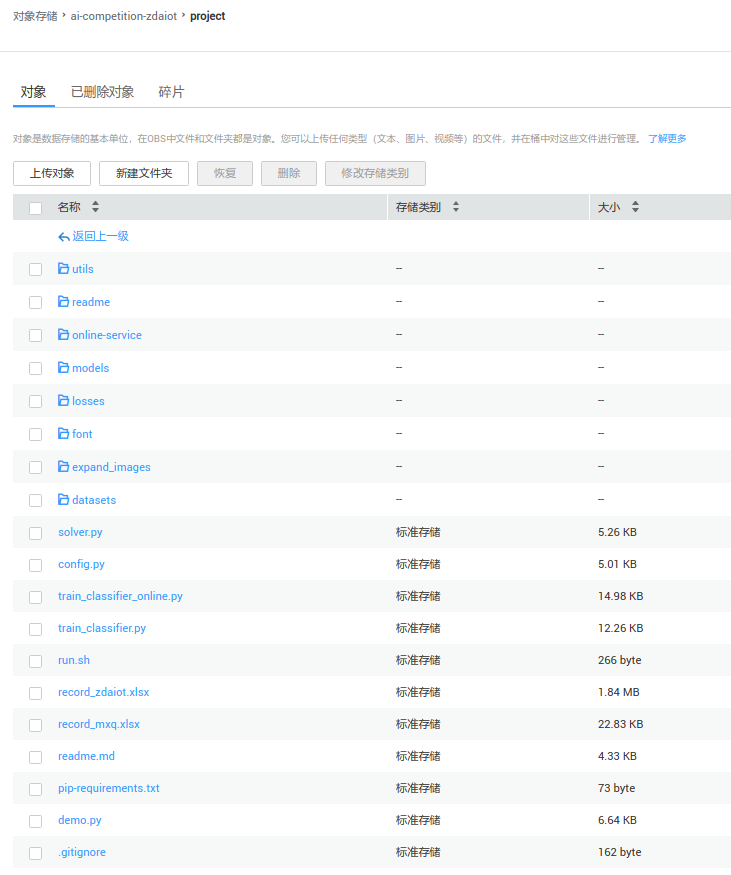
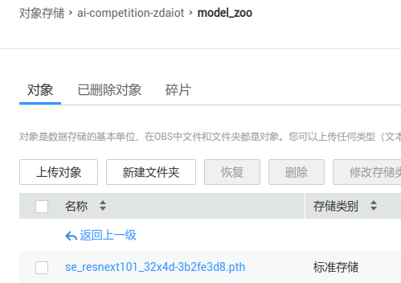
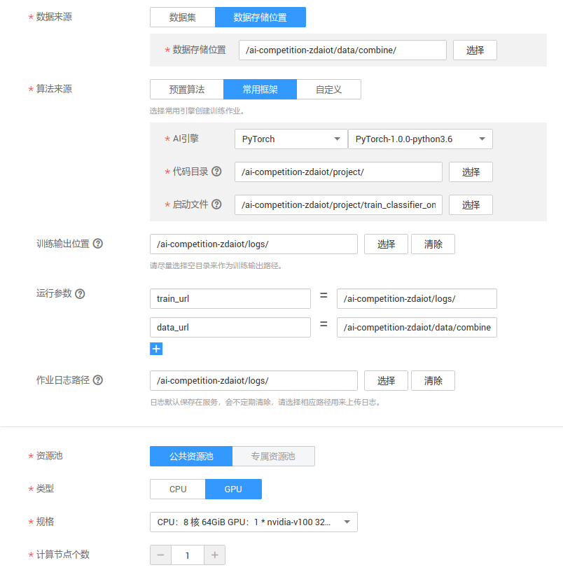

The code for  "华为云人工智能创新应用大赛". The main tasks of the competition are:

The task of this competition is to classify the pictures of popular scenic spots, delicacies, specialties, folklore and handicrafts in Xi'an.

Many strategies were tried during the competition, with a final score of 0.979 and a ranking of 32 / 732. 
Although I didn't get a high ranking in the end, I have a deeper understanding of the classification problem, thanks to Huawei Cloud for organizing the competition. 

This repositorie is suitable for solving all kinds of classification problems, supports a variety of training skills, and has high expansibility.

## Requirements

* Pytorch 1.3.0 
* Torchvision 0.4.0
* Python3.7
* pretrainedmodels
* efficientnet-pytorch
* Chinese font-simhei.ttf, [Download Link](https://fontzone.net/download/simhei). Put simhei in `project_root/font`.

## How to run
### Clone Our Project
```bash
git clone https://github.com/XiangqianMa/AI-Competition-HuaWei.git
cd AI-Competition-HuaWei
```

### Prepare Dataset
Download dataset, unzip and put them into `your_data_path` directory.

Structure of the `your_data_path` folder can be like:
```bash
train_data
label_id_name.json
```

Create soft links of datasets in the following directories:

```bash 
cd AI-Competition-HuaWei
mkdir data
cd data
ln -s your_data_path huawei_data
```

It is important to note that the dataset should be organized in such a way that the following conditions are met:

- The pictures and annotation files are stored in the same folder, as shown in the following figure:

  

- The callout file is in txt format, and its contents are as follows:

  ```
  img_1.jpg, 0
  ```

If it is your own dataset, please process it to be consistent with the above format, otherwise it may cause an error in the running of the program.


### Train

```bash
cd AI-Competition-HuaWei
python train_classifier.py
```

## HuaWei Cloud Online Test

We use `online-service` folder to accomplish online test on HuaWei ModelArts platform.  The struct of this folder is like the following:

You should put your dependencies into `online-service/model` like this:


If you want to import customized package in your code, import sentence should be like this:

```python
from model import xxx
```

Also, you must specified your dependencies in `config.json`:

```python
"dependencies": [
    {
        "installer": "pip",
        "packages": [
            {
                "package_name": "Pillow",
                "package_version": "5.0.0",
                "restraint": "EXACT"
            },
            {
                "package_name": "torchvision",
                "package_version": "0.2.1",
                "restraint": "EXACT"
            },
            {
                "package_name": "tqdm"
            }                
        ]
    }
]
```

## Demo

First, manually create the following folder:

```bash
mkdir data/demo_data
```

After the training is complete, execute the following code to get a visual classification result, and the test will be carried out on the validation set:

```bash
python demo.py
```

After the test is completed, **the sample of the prediction error** will be stored in the `data/demo_data/results` folder.  Examples of demos are as follows:


## How to use obsutil

### Prepare obsutil
Download obsutil from [here](https://support.huaweicloud.com/utiltg-obs/obs_11_0003.html). Unzip it to `./online-service`. After unzipping,  `./online-service` folder will contain `obsutil` and `setup.sh` files

```bash
cd online-service
```

Replace the following `-i=xxxxxxx` to `-i=Access Key Id?AK?` and replace the following `-k=xxxxxxxxxxxxxxxxx` to `-k=Secret Access Key?SK?` 
```bash
./obsutil config -i=xxxxxxx -k=xxxxxxxxxxxxxxxxx -e=obs.cn-north-4.myhuaweicloud.com
```

Then, you will see feedback similar to the one below
```bash
Config file url:
  /home/zdkit/.obsutilconfig

Update config file successfully!
```

Then, execute the following code to check connectivity 
```
./obsutil ls -s
```

If the returned result contains "Bucket number is:", the configuration is correct. Just like these:
```bash
Start at 2019-11-22 15:43:11.060016056 +0000 UTC

obs://ai-competition-zdaiot
obs://test-zdaiot
Bucket number is: 2
```

### Use obsutil
Please Manually change the selected model in `online-service/model/customize_service.py` file.  And  manually change the `model` parameters in `online-service/upload.sh`.  The script will automatically find the newly modified folder from the `checkpoints/${model}` directory and copy the `model_best.pth` from it to the `online-service/model` directory.

> If you want to place the `model_best.pth` file manually, please comment out the `cp ../checkpoints/${model}/${filename}/model_best.pth online-service/model` line in the `online-service/upload.sh` file. Then manually place the weight file `model_best.pth` to the `online-service/model` directory.

Notice that, when you copy pyfiles from `models` to `online-service/model/deploy_models`, you should pay attention to these

- change import path of Python package. For example, change `from models.custom_model import CustomModel` to `from model.deploy_models.custom_model import CustomModel` in `online-service/model/deploy_models/custom_model.py`. 
- modify the parameters of `prepare_model.create_model` function in the `online-service/model/customize_service.py` and `online-service/offline_service.py` according to the actual needs.

When you first use it, you should run this:
```bash
cd online-service
./upload.sh 0
```

Then, this script will create a bucket called `ai-competition-$USER` in your OBS, create a new folder called `model_snapshots`, and upload the `./model` folder to the model_snapshots folder.

> $USER is your Linux username

If you want to update the weight file or python files. Please manually put new python files in the corresponding directory. And run this:
```bash
./upload.sh
```

## How to train online

Suppose you have built a new bucket called `ai-competition-zdaiot`

### upload dataset

Create a new folder named `data` in `ai-competition-zdaiot` bucket .  And upload dataset to `data`. Don't fotget upload `label_id_name.json`. For example:



### upload project

Create a new folder named `project` in`ai-competition-zdaiot` bucket .  And upload Our Project to `project`. Don't fotget upload `font`. For example:



### upload model_zoo

Create a new folder named `model_zoo` in `ai-competition-zdaiot` bucket . And upload pretrained model to `model_zoo`.

For example, I uploaded a pre-training model called `se_resnext101_32x4d-3b2fe3d8.pth`.



### prepare logs folder

Create a new folder named `logs` in `ai-competition-zdaiot` bucket .

### Run

Open `ModelArts->训练管理->训练作业->创建`，Fill in the following parameters



If necessary, add custom parameters in the `训练作业`, and then click OK.

During the training process, you can view the running logs through the `logs` folder under the `ai-competition-zdaiot` bucket root directory.

After training, the inference scripts and the optimal weight will be saved in the `model_snapshots` folder under the `ai-competition-zdaiot` bucket root directory.

## Tricks Tried

### Dataset

- train_data
- combine
- huge
- adversial_samples（Not work，When the samples and their adversial samples are in training set and verification set respectively, the accuracy of the verification set is too high.）

### Data clean

Delete pictures with the following characteristics
- ambiguity
- wrong
- image resolution is too low
- There are no such data characteristics, for example, there are only `石子` in `石子饼` and only `浆水` in `浆水面`.
- The target does not occupy the main body of the image. This is especially important for image classification tasks.
- Tourism promotional images, false advertising images, graffiti

### Augmentation

- CenterCrop(Not well，only 0.969)
- erase_prob
- gray_prob
- cut_mix
- Use more data augmentation, see [here](https://github.com/clovaai/CutMix-PyTorch/blob/e54b8387ad6f63d2b9cb2c1f9dc332aad2d185e1/train.py#L132). (Use Resize, RandomHorizontalFlip, ToTensor, jittering, lighting, Normalize. And use cutmix 0.967)

### Cross validation

- StratifiedKFold
- KFold

### Training strategy

1. Train only on Single image scale
2. The training is divided into two stages, the first stage is training at lower resolution（256）, and the second stage is fine-tuning at higher resolution（416）.
3. The training is divided into three stages, the first stage is trained at a lower resolution（256）, the second stage is fine-tuned at a medium resolution（336）, and the third stage is at a higher resolution（416）.
4. Multi-scale training, switching resolution every several iterations.
5. The training is divided into two stages, the first stage is based on all data sets, and the second stage is only fine-tuning on food. In the second stage of training, get rid of all data enhancement methods.（Not work）
6. Save the optimal model using loss on the validation set（Not work, only 0.972）

### Losses

- CrossEntropy
- SmoothCrossEntropy（best）
- FocalLoss
- CB_Sigmoid
- CB_Focal
- CB_Softmax
- CB_Smooth_Softmax（Not work，0.964）

### Super parameter

- Lr: If the initial learning rates of backbone and fc layers are the same, the convergence speed is too slow.
- Weight decay: Not work
- Epoch： Try more epochs

### Optimizer

- Adam
- SGD

### Lr scheduler

Init Lr and weight decay

- StepLR

- CosineLR

- ReduceLR

- MultiStepLR（18/25，Not work 0.9710）

### Model type

- densenet201

- efficientnet-b5

- se_resnext101_32x4d

## Contributors

* [XiangqianMa](https://github.com/XiangqianMa)
* [Zdaiot](https://github.com/zdaiot)


